# Markdown + Mermaid写作

## 概述

使用Mermaid语法在Markdown文档中创建技术图表和可视化。Mermaid是一个基于文本的图表工具，允许您使用简单的文本语法创建各种类型的图表。将Mermaid代码嵌入到Markdown文件中以生成流程图、序列图、类图、状态图、ER图、甘特图、饼图、思维导图、时序图、Git图、用户旅程图、C4图等。

## 何时使用此技能

在以下情况下使用此技能：
- 在Markdown文档中创建技术图表
- 使用Mermaid语法生成流程图、序列图、类图、状态图、ER图、甘特图、饼图、思维导图、时序图、Git图、用户旅程图、C4图等
- 使用Mermaid Live Editor或Markdown编辑器（如Obsidian）进行实时预览
- 使用Mermaid语法创建技术文档
- 使用Mermaid语法创建架构图
- 使用Mermaid语法创建流程图
- 使用Mermaid语法创建序列图
- 使用Mermaid语法创建类图
- 使用Mermaid语法创建状态图
- 使用Mermaid语法创建ER图
- 使用Mermaid语法创建甘特图
- 使用Mermaid语法创建饼图
- 使用Mermaid语法创建思维导图
- 使用Mermaid语法创建时序图
- 使用Mermaid语法创建Git图
- 使用Mermaid语法创建用户旅程图
- 使用Mermaid语法创建C4图

## 核心能力

### 1. 基本语法

Mermaid图表使用简单的文本语法。基本结构如下：

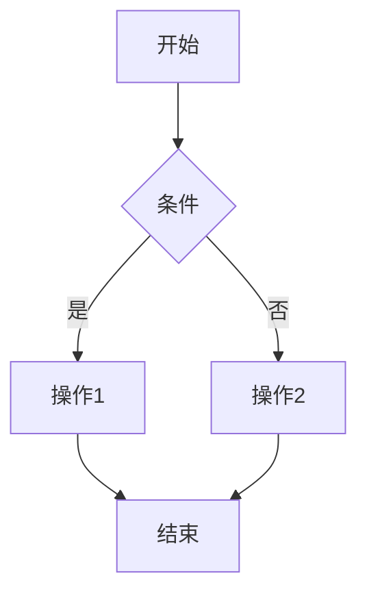

### 2. 流程图

流程图用于表示算法或过程。

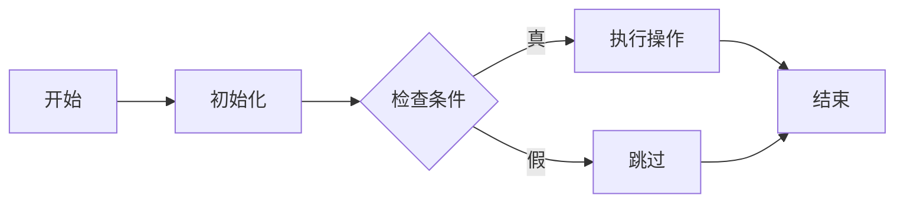

### 3. 序列图

序列图用于表示对象之间的交互。

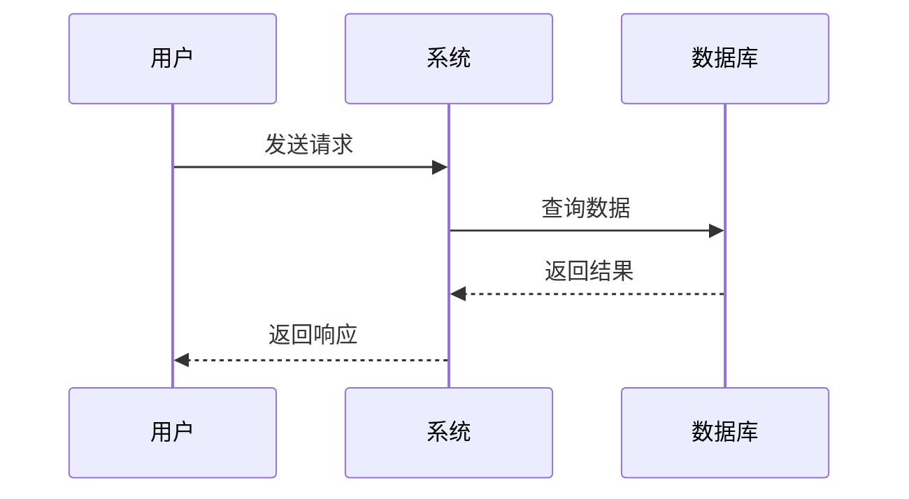

### 4. 类图

类图用于表示类及其关系。

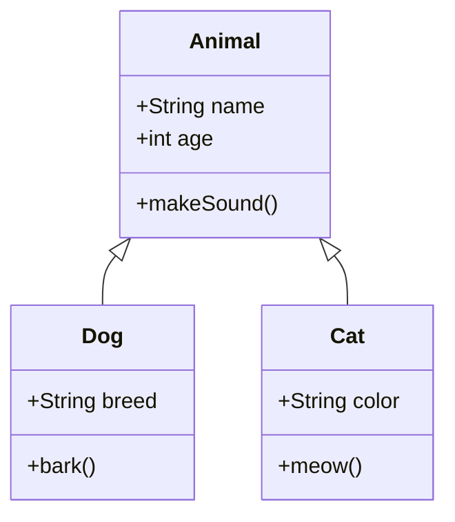

### 5. 状态图

状态图用于表示对象的状态转换。

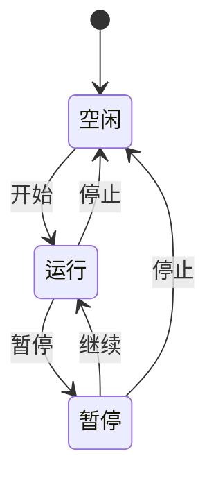

### 6. ER图

ER图用于表示实体关系模型。

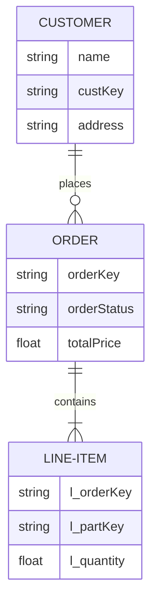

### 7. 甘特图

甘特图用于表示项目时间线。

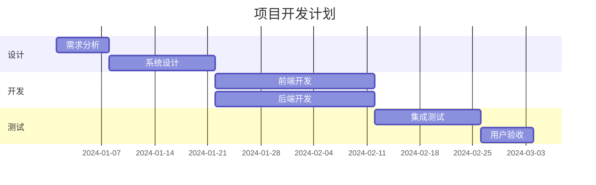

### 8. 饼图

饼图用于表示数据分布。

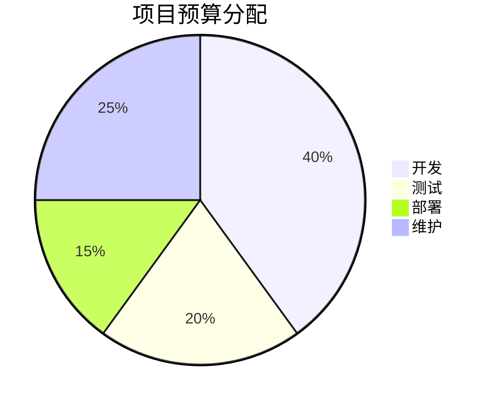

### 9. 思维导图

思维导图用于表示概念和想法。

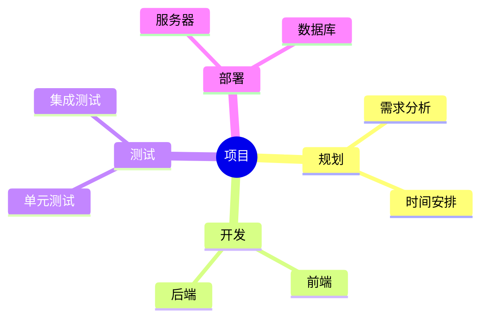

### 10. 时序图

时序图用于表示时间线上的事件。

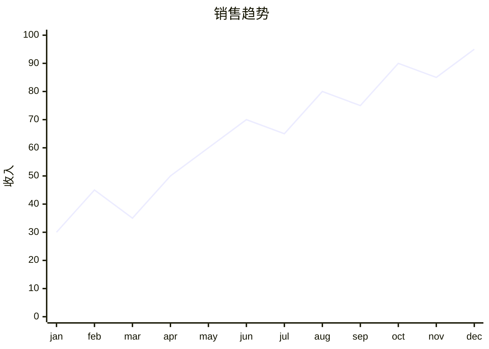

### 11. Git图

Git图用于表示Git分支和提交。

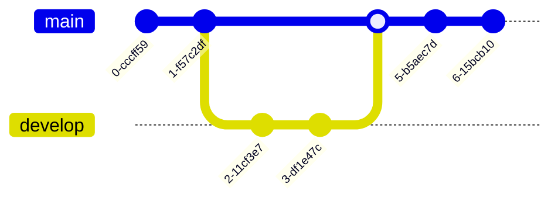

### 12. 用户旅程图

用户旅程图用于表示用户交互流程。

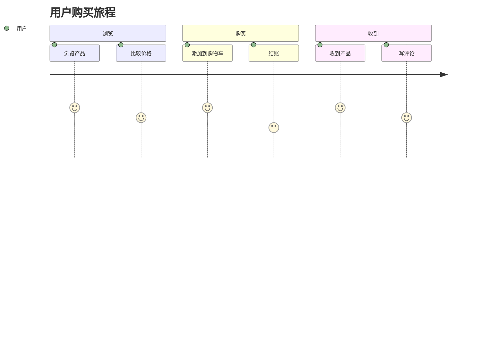

### 13. C4图

C4图用于表示软件架构。

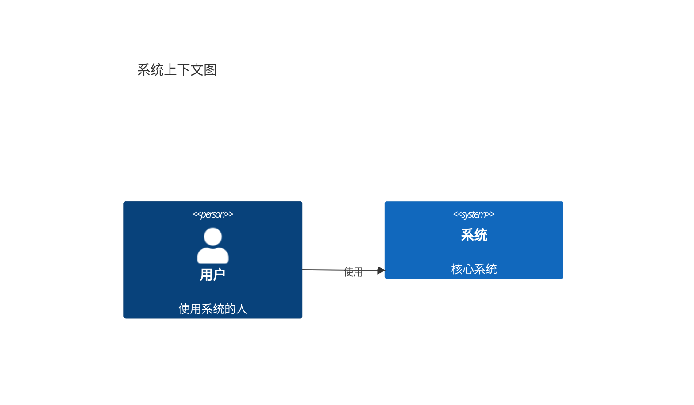

## 工具和编辑器

### Mermaid Live Editor

Mermaid Live Editor是一个在线编辑器，允许您实时预览Mermaid图表。

- 访问：https://mermaid.live
- 在左侧编辑器中输入Mermaid代码
- 在右侧预览图表
- 导出为SVG、PNG等格式

### Markdown编辑器

许多Markdown编辑器支持Mermaid语法：

- **Obsidian**：原生支持Mermaid
- **Typora**：原生支持Mermaid
- **VS Code**：通过插件支持Mermaid
- **GitHub**：原生支持Mermaid
- **GitLab**：原生支持Mermaid

## 最佳实践

1. **保持简单**：避免过于复杂的图表
2. **使用清晰的标签**：使用描述性的节点和边标签
3. **保持一致性**：在整个文档中使用一致的样式
4. **测试图表**：在Mermaid Live Editor中测试图表
5. **文档化图表**：为图表添加标题和描述
6. **使用子图**：对于复杂图表，使用子图进行组织
7. **考虑可访问性**：为图表提供文本描述

## 常见问题

**Q: Mermaid支持哪些图表类型？**
A: Mermaid支持流程图、序列图、类图、状态图、ER图、甘特图、饼图、思维导图、时序图、Git图、用户旅程图、C4图等。

**Q: 如何在Markdown中使用Mermaid？**
A: 使用 ```mermaid 代码块包围Mermaid代码。

**Q: Mermaid图表可以导出吗？**
A: 是的，可以使用Mermaid Live Editor将图表导出为SVG、PNG等格式。

**Q: Mermaid支持自定义样式吗？**
A: 是的，Mermaid支持自定义样式，包括颜色、字体、大小等。

## 资源

- **Mermaid官方文档**：https://mermaid.js.org/intro/
- **Mermaid Live Editor**：https://mermaid.live
- **Mermaid GitHub**：https://github.com/mermaid-js/mermaid
