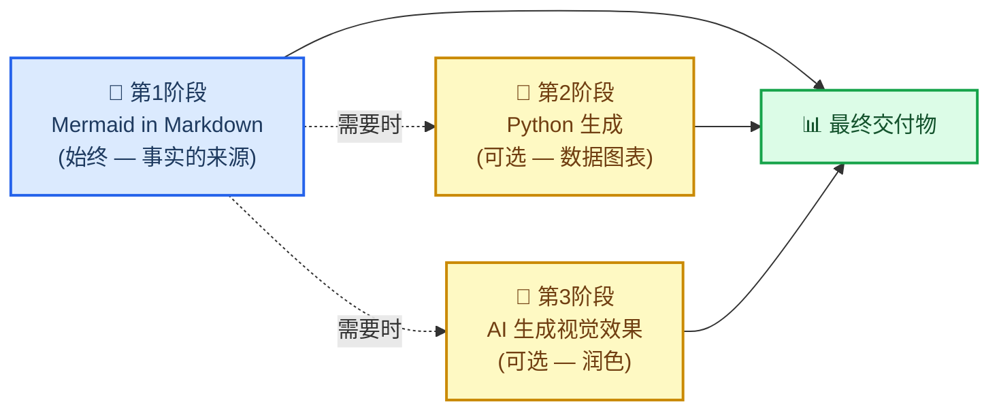
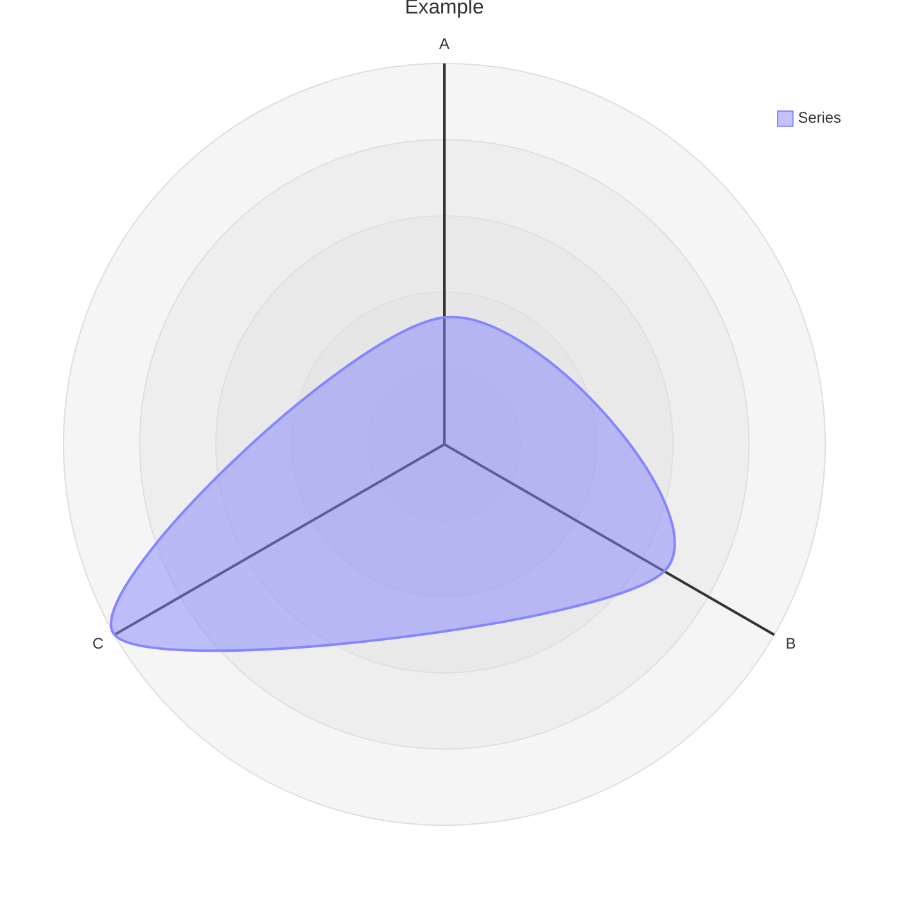

# Markdown和Mermaid写作

## 概述

本技能教授并强制执行使用**带有嵌入式Mermaid图表的Markdown作为默认和规范格式**创建科学文档的标准。

核心观点：在`.md`文件中用Mermaid图表表达的关系比任何图像都更有价值。它是文本，因此在git中差异清晰。不需要构建步骤。在GitHub、GitLab、Notion、VS Code和任何Markdown查看器中原生渲染。与相同关系的散文描述相比，它使用更少的tokens。并且它总是可以稍后转换为精美的图像——但文本版本仍然是事实的来源。

> "你越多地将你的报告和文件放在.md中，以普通文本形式，mermaid也是如此，同时也是一种简单的'脚本语言'。这有助于任何下游渲染，尤其是AI生成的图像（使用mermaid而不是仅使用长文本描述关系 < tokens）。此外，mermaid可以与markdown一起渲染，以便人类或AI几乎在任何地方轻松使用。"
>
> — Clayton Young (@borealBytes), K-Dense Discord, 2026-02-19

## 何时使用此技能

在以下情况下使用此技能：

- 创建**任何科学文档** — 报告、分析、手稿、方法部分
- 编写**任何文档** — README、操作指南、决策记录、项目文档
- 制作**任何图表** — 工作流程、数据管道、架构、时间线、关系
- 生成**任何将被版本控制的输出** — 如果它要进入git，它应该是markdown
- 与**任何其他技能**一起工作 — 此技能定义了包装所有其他输出的文档层
- 有人要求你"添加图表"或"可视化关系" — 始终首选Mermaid

不要为结构或关系图开始使用Python matplotlib、seaborn或AI图像生成。这些是第2阶段和第3阶段 — 仅在Mermaid无法表达所需内容时使用（例如，带有真实数据的散点图、逼真图像）。

## 🎨 源格式哲学

### 为什么基于文本的图表胜出

| 重要因素 | Mermaid in Markdown | Python / AI 图像 |
| ----------------------------- | :-----------------: | :---------------: |
| Git 差异可读 | ✅ | ❌ 二进制 blob |
| 无需重新生成即可编辑 | ✅ | ❌ |
| 与散文相比令牌高效 | ✅ 更小 | ❌ 更大 |
| 无需构建步骤即可渲染 | ✅ | ❌ 需要托管 |
| 无需视觉即可被AI解析 | ✅ | ❌ |
| 在 GitHub / GitLab / Notion 中工作 | ✅ | ⚠️ 如果托管 |
| 可访问性（屏幕阅读器） | ✅ accTitle/accDescr | ⚠️ 需要 alt 文本 |
| 稍后可转换为图像 | ✅ 随时 | — 已是图像 |

### 三阶段工作流



**第1阶段是强制性的。** 即使你进行到第2阶段或第3阶段，Mermaid 源文件仍需提交。

### Mermaid可以表达什么

Mermaid 涵盖 24 种图表类型。几乎所有科学关系都适合其中一种：

| 使用场景 | 图表类型 | 文件 |
| -------------------------------------------- | ---------------- | ---------------------------------------------------- |
| 实验工作流 / 决策逻辑 | 流程图 | `references/diagrams/flowchart.md` |
| 服务交互 / API 调用 / 消息传递 | 序列图 | `references/diagrams/sequence.md` |
| 数据模型 / 模式 | ER 图 | `references/diagrams/er.md` |
| 状态机 / 生命周期 | 状态图 | `references/diagrams/state.md` |
| 项目时间线 / 路线图 | 甘特图 | `references/diagrams/gantt.md` |
| 比例 / 组成 | 饼图 | `references/diagrams/pie.md` |
| 系统架构（缩放级别） | C4 | `references/diagrams/c4.md` |
| 概念层次结构 / 头脑风暴 | 思维导图 | `references/diagrams/mindmap.md` |
| 时间顺序事件 / 历史 | 时间线 | `references/diagrams/timeline.md` |
| 类层次结构 / 类型关系 | 类图 | `references/diagrams/class.md` |
| 用户旅程 / 满意度地图 | 用户旅程 | `references/diagrams/user_journey.md` |
| 双轴比较 / 优先级 | 象限图 | `references/diagrams/quadrant.md` |
| 需求可追溯性 | 需求图 | `references/diagrams/requirement.md` |
| 流大小 / 资源分配 | 桑基图 | `references/diagrams/sankey.md` |
| 数值趋势 / 条形 + 折线图 | XY 图表 | `references/diagrams/xy_chart.md` |
| 组件布局 / 空间排列 | 方块图 | `references/diagrams/block.md` |
| 工作项状态 / 任务列 | 看板 | `references/diagrams/kanban.md` |
| 云基础设施 / 服务拓扑 | 架构图 | `references/diagrams/architecture.md` |
| 多维比较 / 技能雷达 | 雷达图 | `references/diagrams/radar.md` |
| 层次比例 / 预算 | 树图 | `references/diagrams/treemap.md` |
| 二进制协议 / 数据格式 | 数据包图 | `references/diagrams/packet.md` |
| Git 分支 / 合并策略 | Git 图 | `references/diagrams/git_graph.md` |
| 代码风格序列（编程语法） | ZenUML | `references/diagrams/zenuml.md` |
| 多图表组合模式 | 复杂示例 | `references/diagrams/complex_examples.md` |

> 💡 **选择正确的类型，而不是简单的类型。** 不要默认使用流程图来处理所有事情。对于时间顺序事件，时间线优于流程图。对于服务交互，序列图优于流程图。扫描表格并匹配。

---

## 🔧 核心工作流

### 步骤 1：识别文档类型

在从头开始编写之前，检查是否存在模板：

| 文档类型 | 模板 |
| ------------------------------ | ----------------------------------------------- |
| 拉取请求记录 | `templates/pull_request.md` |
| 问题 / 缺陷 / 功能请求 | `templates/issue.md` |
| 冲刺 / 项目看板 | `templates/kanban.md` |
| 架构决策（ADR） | `templates/decision_record.md` |
| 演示 / 简报 | `templates/presentation.md` |
| 研究论文 / 分析 | `templates/research_paper.md` |
| 项目文档 | `templates/project_documentation.md` |
| 操作指南 / 教程 | `templates/how_to_guide.md` |
| 状态报告 | `templates/status_report.md` |

### 步骤 2：阅读样式指南

在编写任何 `.md` 文件之前：阅读 `references/markdown_style_guide.md`。

需要内化的关键规则：

- **每个文档一个 H1** — 标题。永远不要更多。
- **仅 H2 标题使用表情符号** — 每个 H2 一个表情符号，H3/H4 中不使用
- **引用所有内容** — 每个外部声明都使用脚注 `[^N]` 并提供完整 URL
- **谨慎使用粗体** — 每段最多 2-3 个粗体术语，永远不要整句
- **每个 `</details>` 后使用水平分隔线** — 强制性
- **比较、配置、结构化数据使用表格而非散文**
- **图表优于文字墙** — 如果描述流程、结构或关系，添加 Mermaid

### 步骤 3：选择图表类型并阅读其指南

在创建任何 Mermaid 图表之前：阅读 `references/mermaid_style_guide.md`。

然后打开特定类型文件（例如 `references/diagrams/flowchart.md`）获取示例、提示和复制粘贴模板。

每个图表的强制性规则：

```
accTitle: 简短名称 3-8 字
accDescr: 一两个句子解释此图表显示的内容。
```

- **不使用 `%%{init}` 指令** — 破坏 GitHub 暗色模式
- **不使用内联 `style`** — 仅使用 `classDef`
- **每个节点最多一个表情符号** — 在标签开始处
- **`snake_case` 节点 ID** — 与标签匹配

### 步骤 4：编写文档

从模板开始。应用 Markdown 样式指南。将图表与相关文本内联放置 — 而不是在单独的“图”部分。

### 步骤 5：作为文本提交

带有嵌入式 Mermaid 的 `.md` 文件是要提交的内容。如果您还生成了 PNG 或 AI 图像，这些是补充性的 — Markdown 是源。

---

## ⚠️ 常见陷阱

### 雷达图语法 (`radar-beta`)

**错误：**
```mermaid
radar
title Example
x-axis ["A", "B", "C"]
"Series" : [1, 2, 3]
```

**正确：**


- **使用 `radar-beta`** 而不是 `radar`（裸关键字不存在）
- **使用 `axis`** 定义维度，**不** 使用 `x-axis`
- **使用 `curve`** 定义数据系列，**不** 使用带冒号的引用标签
- **没有 `accTitle`/`accDescr`** — radar-beta 不支持可访问性注释；始终在图表上方添加描述性斜体段落

### XY 图表与雷达图混淆

| 图表 | 关键字 | 轴语法 | 数据语法 |
| ------- | ------- | ----------- | ----------- |
| **XY 图表**（条形/折线） | `xychart-beta` | `x-axis ["Label1", "Label2"]` | `bar [10, 20]` 或 `line [10, 20]` |
| **雷达图**（蜘蛛/网络） | `radar-beta` | `axis id["Label"]` | `curve id["Label"]{10, 20}` |

### 忘记在支持的类型上使用 `accTitle`/`accDescr`

只有部分图表类型支持 `accTitle`/`accDescr`。对于不支持的类型，始终在代码块正上方放置描述性斜体段落：

> _雷达图比较三种方法在五个性能维度上的表现。注意：雷达图不支持 accTitle/accDescr。_


---

## 🔗 与其他技能的集成

### 与 `scientific-schematics` 集成

`scientific-schematics` 生成 AI 驱动的出版质量图像（PNG）。使用 Mermaid 图表作为示意图的**简报**：

```
工作流：
1. 在 .md 中创建 Mermaid 概念（此技能 — 第 1 阶段）
2. 向 scientific-schematics 描述相同概念以获取精美的 PNG（第 3 阶段）
3. 提交两者 — .md 作为源，PNG 作为补充图
```

### 与 `scientific-writing` 集成

当 `scientific-writing` 生成手稿时，所有图表和结构图形应使用此技能的标准。写作技能处理散文和引用；此技能处理视觉结构。

```
工作流：
1. 使用 scientific-writing 起草手稿
2. 对于显示工作流、架构或关系的每个图：
   - 用遵循此技能指南的 Mermaid 图表替换占位符
3. 仅对真正需要逼真/复杂渲染的图使用 scientific-schematics
```

### 与 `literature-review` 集成

文献综述产生包含大量关系数据的摘要。使用此技能：

- 创建文献景观的概念图（思维导图）
- 显示出版物时间线（时间线或甘特图）
- 比较方法（象限图或雷达图）
- 绘制论文中描述的数据流（序列图或流程图）

### 与产生输出文档的任何技能集成

在最终确定任何技能的任何文档之前，应用此技能的清单：

- [ ] 文档是否使用模板？如果是，我是否从正确的模板开始？
- [ ] 所有图表是否都在 Mermaid 中并带有 `accTitle` + `accDescr`？
- [ ] 没有 `%%{init}`，没有内联 `style`，只有 `classDef`？
- [ ] 所有外部声明是否都用 `[^N]` 引用？
- [ ] 一个 H1，仅 H2 使用表情符号？
- [ ] 每个 `</details>` 后有水平分隔线？

---

## 📚 参考索引

### 样式指南

| 指南 | 路径 | 行数 | 涵盖内容 |
| ----------------------- | ------------------------------------------- | ----- | -------------------------------------------------- |
| Markdown 样式指南 | `references/markdown_style_guide.md` | ~733 | 标题、格式、引用、表格、Mermaid 集成、模板、质量清单 |
| Mermaid 样式指南 | `references/mermaid_style_guide.md` | ~458 | 可访问性、表情符号集、颜色类、主题中性、类型选择、复杂度级别 |

### 图表类型指南（24 种类型）

每个文件包含：生产质量示例、特定于该类型的提示和复制粘贴模板。

`references/diagrams/` — architecture, block, c4, class, complex\_examples, er, flowchart, gantt, git\_graph, kanban, mindmap, packet, pie, quadrant, radar, requirement, sankey, sequence, state, timeline, treemap, user\_journey, xy\_chart, zenuml

### 文档模板（9 种类型）

`templates/` — decision\_record, how\_to\_guide, issue, kanban, presentation, project\_documentation, pull\_request, research\_paper, status\_report

### 示例

`assets/examples/example-research-report.md` — 完整的科学研究报告，展示了正确的标题层次结构、多种图表类型（流程图、序列图、甘特图）、表格、脚注引用、可折叠部分以及所有样式指南规则的应用。

---

## 📝 归因

本技能中的所有样式指南、图表类型指南和文档模板均从 `SuperiorByteWorks-LLC/agent-project` 存储库移植，在 Apache-2.0 许可下。

- **来源**：https://github.com/SuperiorByteWorks-LLC/agent-project
- **作者**：Clayton Young / Superior Byte Works, LLC (@borealBytes)
- **许可**：Apache-2.0

此技能（作为 scientific-agent-skills 的一部分）在 MIT 许可下分发。包含的 Apache-2.0 内容兼容下游使用，保留归因，如本技能中文件头中所保存。

---

[^1]: GitHub Blog. (2022). "Include diagrams in your Markdown files with Mermaid." https://github.blog/2022-02-14-include-diagrams-markdown-files-mermaid/

[^2]: Mermaid. "Mermaid Diagramming and Charting Tool." https://mermaid.js.org/

## 工具和编辑器

### Mermaid Live Editor

Mermaid Live Editor是一个在线编辑器，允许您实时预览Mermaid图表。

- 访问：https://mermaid.live
- 在左侧编辑器中输入Mermaid代码
- 在右侧预览图表
- 导出为SVG、PNG等格式

### Markdown编辑器

许多Markdown编辑器支持Mermaid语法：

- **Obsidian**：原生支持Mermaid
- **Typora**：原生支持Mermaid
- **VS Code**：通过插件支持Mermaid
- **GitHub**：原生支持Mermaid
- **GitLab**：原生支持Mermaid

## 最佳实践

1. **保持简单**：避免过于复杂的图表
2. **使用清晰的标签**：使用描述性的节点和边标签
3. **保持一致性**：在整个文档中使用一致的样式
4. **测试图表**：在Mermaid Live Editor中测试图表
5. **文档化图表**：为图表添加标题和描述
6. **使用子图**：对于复杂图表，使用子图进行组织
7. **考虑可访问性**：为图表提供文本描述

## 常见问题

**Q: Mermaid支持哪些图表类型？**
A: Mermaid支持流程图、序列图、类图、状态图、ER图、甘特图、饼图、思维导图、时序图、Git图、用户旅程图、C4图等。

**Q: 如何在Markdown中使用Mermaid？**
A: 使用 ```mermaid 代码块包围Mermaid代码。

**Q: Mermaid图表可以导出吗？**
A: 是的，可以使用Mermaid Live Editor将图表导出为SVG、PNG等格式。

**Q: Mermaid支持自定义样式吗？**
A: 是的，Mermaid支持自定义样式，包括颜色、字体、大小等。

## 资源

- **Mermaid官方文档**：https://mermaid.js.org/intro/
- **Mermaid Live Editor**：https://mermaid.live
- **Mermaid GitHub**：https://github.com/mermaid-js/mermaid
