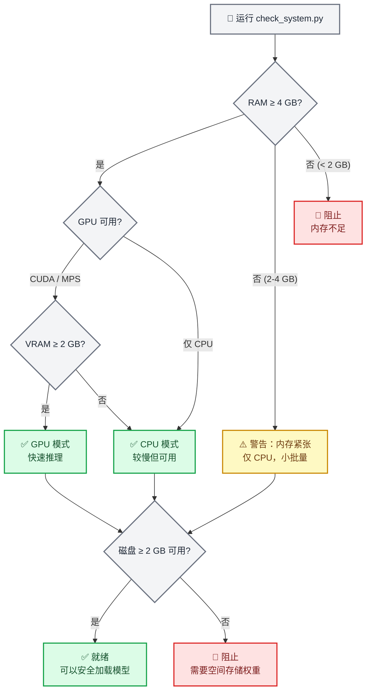
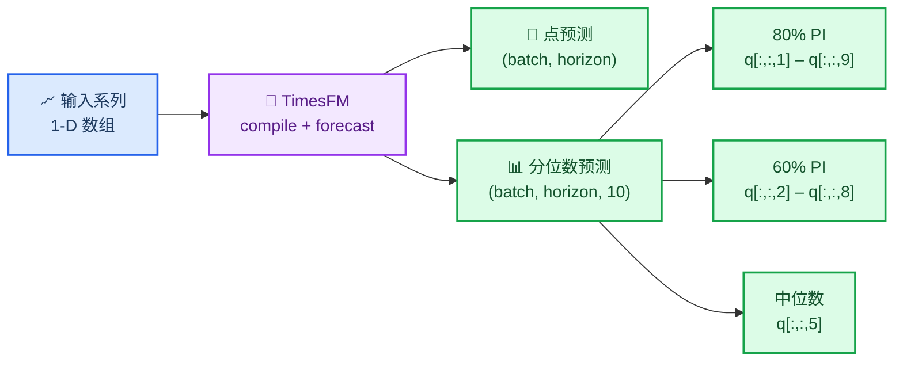
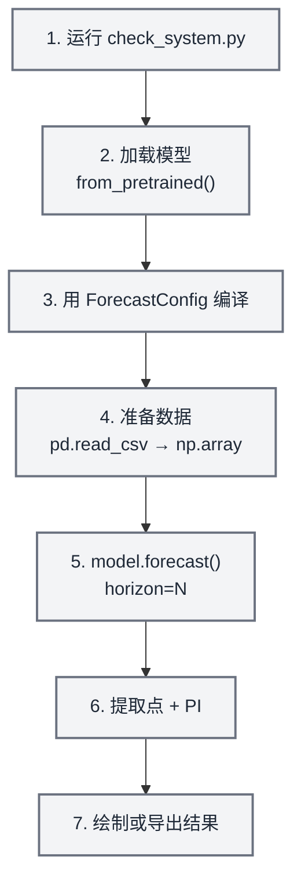
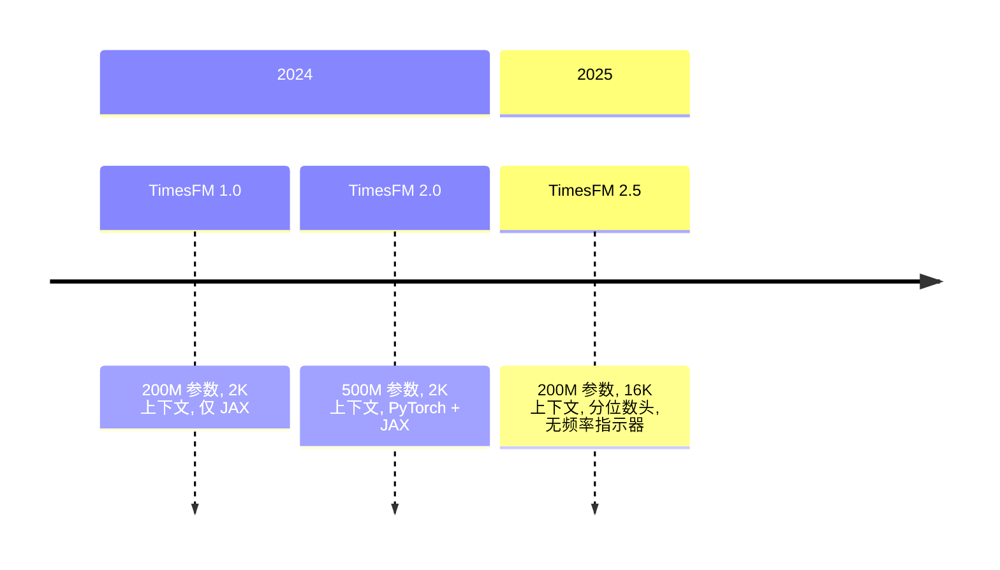

# TimesFM 预测

## 概述

TimesFM（时间序列基础模型）是由 Google Research 开发的用于时间序列预测的预训练解码器基础模型。它可以**零样本**工作——输入任何单变量时间序列，它会返回带校准分位数预测区间的点预测，无需训练。

此技能包装了 TimesFM，用于安全、适合代理的本地推理。它包含一个**强制的预检系统检查器**，在加载模型之前验证 RAM、GPU 内存和磁盘空间，确保代理不会使用户的机器崩溃。

> **关键数据**：TimesFM 2.5 使用 2 亿参数（磁盘上约 800 MB，CPU 上约 1.5 GB RAM，GPU 上约 1 GB VRAM）。已归档的 v1/v2 5 亿参数模型需要约 32 GB RAM。请始终先运行系统检查器。

## 何时使用此技能

当您需要以下功能时，应使用此技能：

- 预测**任何单变量时间序列**（销售、需求、传感器、生命体征、价格、天气）
- 需要**零样本预测**，无需训练自定义模型
- 希望获得**概率预测**，带有校准的预测区间（分位数）
- 您的时间序列长度**任意**（模型处理 1–16,384 个上下文点）
- 需要**批量预测**数百或数千个序列
- 希望使用**基础模型**方法，而不是手动调整 ARIMA/ETS 参数

**不要**在以下情况使用此技能：

- 需要具有系数解释的经典统计模型 → 使用 `statsmodels`
- 需要时间序列分类或聚类 → 使用 `aeon`
- 需要多元向量自回归或 Granger 因果关系 → 使用 `statsmodels`
- 您的数据是表格型（非时间序列）→ 使用 `scikit-learn`

> **关于异常检测的注意**：TimesFM 没有内置的异常检测功能，但您可以**使用分位数预测作为预测区间**——90% 置信区间（q10–q90）之外的值在统计上是不寻常的。请查看 `examples/anomaly-detection/` 目录获取完整示例。

## ⚠️ 强制预检：系统要求检查

**关键 — 首次加载模型前务必运行系统检查器。**

```bash
python scripts/check_system.py
```

此脚本检查：

1. **可用 RAM** — 低于 4 GB 时警告，低于 2 GB 时阻止
2. **GPU 可用性** — 检测 CUDA/MPS 设备和 VRAM
3. **磁盘空间** — 验证约 800 MB 模型下载的空间
4. **Python 版本** — 需要 3.10+
5. **现有安装** — 检查是否安装了 `timesfm` 和 `torch`

> **注意**：模型权重**不存储在此仓库中**。TimesFM 权重（约 800 MB）在首次使用时从 HuggingFace 按需下载并缓存到 `~/.cache/huggingface/`。预检检查器确保在开始任何下载之前有足够的资源。



### 按模型版本的硬件要求

| 模型 | 参数 | RAM (CPU) | VRAM (GPU) | 磁盘 | 上下文 |
| ----- | ---------- | --------- | ---------- | ---- | ------- |
| **TimesFM 2.5**（推荐） | 200M | ≥ 4 GB | ≥ 2 GB | ~800 MB | 最多 16,384 |
| TimesFM 2.0（已归档） | 500M | ≥ 16 GB | ≥ 8 GB | ~2 GB | 最多 2,048 |
| TimesFM 1.0（已归档） | 200M | ≥ 8 GB | ≥ 4 GB | ~800 MB | 最多 2,048 |

> **建议**：除非您有特定理由使用旧检查点，否则始终使用 TimesFM 2.5。它更小、更快，支持 8 倍长的上下文。

## 🔧 安装

### 步骤 1：验证系统（始终首先执行）

```bash
python scripts/check_system.py
```

### 步骤 2：安装 TimesFM

```bash
# 使用 uv（此仓库推荐）
uv pip install timesfm[torch]

# 或使用 pip
pip install timesfm[torch]

# 对于 JAX/Flax 后端（在 TPU/GPU 上更快）
uv pip install timesfm[flax]
```

### 步骤 3：为您的硬件安装 PyTorch

```bash
# CUDA 12.1（NVIDIA GPU）
pip install torch>=2.0.0 --index-url https://download.pytorch.org/whl/cu121

# 仅 CPU
pip install torch>=2.0.0 --index-url https://download.pytorch.org/whl/cpu

# Apple Silicon（MPS）
pip install torch>=2.0.0  # MPS 支持是内置的
```

### 步骤 4：验证安装

```python
import timesfm
import numpy as np
print(f"TimesFM 版本: {timesfm.__version__}")
print("安装正常")
```

## 🎯 快速开始

### 最小示例（5 行）

```python
import torch, numpy as np, timesfm

torch.set_float32_matmul_precision("high")

model = timesfm.TimesFM_2p5_200M_torch.from_pretrained(
    "google/timesfm-2.5-200m-pytorch"
)
model.compile(timesfm.ForecastConfig(
    max_context=1024, max_horizon=256, normalize_inputs=True,
    use_continuous_quantile_head=True, force_flip_invariance=True,
    infer_is_positive=True, fix_quantile_crossing=True,
))

point, quantiles = model.forecast(horizon=24, inputs=[
    np.sin(np.linspace(0, 20, 200)),  # 任何 1-D 数组
])
# point.shape == (1, 24)        — 中位数预测
# quantiles.shape == (1, 24, 10) — 10th–90th 百分位带
```

### 从 CSV 预测

```python
import pandas as pd, numpy as np

df = pd.read_csv("monthly_sales.csv", parse_dates=["date"], index_col="date")

# 将每列转换为数组列表
inputs = [df[col].dropna().values.astype(np.float32) for col in df.columns]

point, quantiles = model.forecast(horizon=12, inputs=inputs)

# 构建结果数据框
for i, col in enumerate(df.columns):
    last_date = df[col].dropna().index[-1]
    future_dates = pd.date_range(last_date, periods=13, freq="MS")[1:]
    forecast_df = pd.DataFrame({
        "date": future_dates,
        "forecast": point[i],
        "lower_80": quantiles[i, :, 2],  # 20th 百分位
        "upper_80": quantiles[i, :, 8],  # 80th 百分位
    })
    print(f"\n--- {col} ---")
    print(forecast_df.to_string(index=False))
```

### 使用协变量预测（XReg）

TimesFM 2.5+ 通过 `forecast_with_covariates()` 支持外生变量。需要 `timesfm[xreg]`。

```python
# 需要: uv pip install timesfm[xreg]
point, quantiles = model.forecast_with_covariates(
    inputs=inputs,
    dynamic_numerical_covariates={"price": price_arrays},
    dynamic_categorical_covariates={"holiday": holiday_arrays},
    static_categorical_covariates={"region": region_labels},
    xreg_mode="xreg + timesfm",  # 或 "timesfm + xreg"
)
```

| 协变量类型 | 描述 | 示例 |
| -------------- | ----------- | ------- |
| `dynamic_numerical` | 时变数值 | 价格、温度、促销支出 |
| `dynamic_categorical` | 时变分类 | 假日标志、星期几 |
| `static_numerical` | 每系列数值 | 商店大小、账户年龄 |
| `static_categorical` | 每系列分类 | 商店类型、区域、产品类别 |

**XReg 模式：**
- `"xreg + timesfm"`（默认）：TimesFM 先预测，然后 XReg 调整残差
- `"timesfm + xreg"`：XReg 先拟合，然后 TimesFM 预测残差

> 请查看 `examples/covariates-forecasting/` 获取带有合成零售数据的完整示例。

### 异常检测（通过分位数区间）

TimesFM 没有内置的异常检测功能，但**分位数预测自然提供预测区间**，可以检测异常：

```python
point, q = model.forecast(horizon=H, inputs=[values])

# 90% 预测区间
lower_90 = q[0, :, 1]  # 10th 百分位
upper_90 = q[0, :, 9]  # 90th 百分位

# 检测异常：90% CI 之外的值
actual = test_values  # 您的保留数据
anomalies = (actual < lower_90) | (actual > upper_90)

# 严重程度级别
is_warning = (actual < q[0, :, 2]) | (actual > q[0, :, 8])  # 80% CI 之外
is_critical = anomalies  # 90% CI 之外
```

| 严重程度 | 条件 | 解释 |
| -------- | --------- | -------------- |
| **正常** | 在 80% CI 内 | 预期行为 |
| **警告** | 在 80% CI 外 | 不寻常但可能 |
| **严重** | 在 90% CI 外 | 统计上罕见（< 10% 概率） |

> 请查看 `examples/anomaly-detection/` 获取带有可视化的完整示例。

```python
# 需要: uv pip install timesfm[xreg]
point, quantiles = model.forecast_with_covariates(
    inputs=inputs,
    dynamic_numerical_covariates={"temperature": temp_arrays},
    dynamic_categorical_covariates={"day_of_week": dow_arrays},
    static_categorical_covariates={"region": region_labels},
    xreg_mode="xreg + timesfm",  # 或 "timesfm + xreg"
)
```

## 📊 理解输出

### 分位数预测结构

TimesFM 返回 `(point_forecast, quantile_forecast)`：

- **`point_forecast`**：形状 `(batch, horizon)` — 中位数（0.5 分位数）
- **`quantile_forecast`**：形状 `(batch, horizon, 10)` — 十个切片：

| 索引 | 分位数 | 用途 |
| ----- | -------- | --- |
| 0 | 均值 | 平均预测 |
| 1 | 0.1 | 80% PI 的下限 |
| 2 | 0.2 | 60% PI 的下限 |
| 3 | 0.3 | — |
| 4 | 0.4 | — |
| **5** | **0.5** | **中位数 (= `point_forecast`)** |
| 6 | 0.6 | — |
| 7 | 0.7 | — |
| 8 | 0.8 | 60% PI 的上限 |
| 9 | 0.9 | 80% PI 的上限 |

### 提取预测区间

```python
point, q = model.forecast(horizon=H, inputs=data)

# 80% 预测区间（最常用）
lower_80 = q[:, :, 1]  # 10th 百分位
upper_80 = q[:, :, 9]  # 90th 百分位

# 60% 预测区间（更窄）
lower_60 = q[:, :, 2]  # 20th 百分位
upper_60 = q[:, :, 8]  # 80th 百分位

# 中位数（与点预测相同）
median = q[:, :, 5]
```



## 🔧 ForecastConfig 参考

所有预测行为由 `timesfm.ForecastConfig` 控制：

```python
timesfm.ForecastConfig(
    max_context=1024,                    # 最大上下文窗口（截断更长的系列）
    max_horizon=256,                     # 最大预测范围
    normalize_inputs=True,               # 归一化输入（推荐用于稳定性）
    per_core_batch_size=32,              # 每个设备的批量大小（根据内存调整）
    use_continuous_quantile_head=True,   # 长预测范围的更好分位数准确性
    force_flip_invariance=True,          # 确保 f(-x) = -f(x)（数学一致性）
    infer_is_positive=True,              # 当所有输入 > 0 时，将预测限制为 ≥ 0
    fix_quantile_crossing=True,          # 确保 q10 ≤ q20 ≤ ... ≤ q90
    return_backcast=False,               # 返回回测（用于协变量工作流程）
)
```

| 参数 | 默认值 | 何时更改 |
| --------- | ------- | -------------- |
| `max_context` | 0 | 设置为匹配您最长的历史窗口（例如，512, 1024, 4096） |
| `max_horizon` | 0 | 设置为您的最大预测长度 |
| `normalize_inputs` | False | **始终设置为 True** — 防止依赖尺度的不稳定性 |
| `per_core_batch_size` | 1 | 增加以提高吞吐量；减少以避免 OOM |
| `use_continuous_quantile_head` | False | **设置为 True** 以获得校准的预测区间 |
| `force_flip_invariance` | True | 除非分析表明它有负面影响，否则保持 True |
| `infer_is_positive` | True | 对于可能为负的系列（温度、回报）设置为 False |
| `fix_quantile_crossing` | False | **设置为 True** 以保证单调分位数 |

## 📋 常见工作流程

### 工作流程 1：单个系列预测



```python
import torch, numpy as np, pandas as pd, timesfm

# 1. 系统检查（运行一次）
# python scripts/check_system.py

# 2-3. 加载和编译
torch.set_float32_matmul_precision("high")
model = timesfm.TimesFM_2p5_200M_torch.from_pretrained(
    "google/timesfm-2.5-200m-pytorch"
)
model.compile(timesfm.ForecastConfig(
    max_context=512, max_horizon=52, normalize_inputs=True,
    use_continuous_quantile_head=True, fix_quantile_crossing=True,
))

# 4. 准备数据
df = pd.read_csv("weekly_demand.csv", parse_dates=["week"])
values = df["demand"].values.astype(np.float32)

# 5. 预测
point, quantiles = model.forecast(horizon=52, inputs=[values])

# 6. 提取预测区间
forecast_df = pd.DataFrame({
    "forecast": point[0],
    "lower_80": quantiles[0, :, 1],
    "upper_80": quantiles[0, :, 9],
})

# 7. 绘制
import matplotlib.pyplot as plt
fig, ax = plt.subplots(figsize=(12, 5))
ax.plot(values[-104:], label="历史")
x_fc = range(len(values[-104:]), len(values[-104:]) + 52)
ax.plot(x_fc, forecast_df["forecast"], label="预测", color="tab:orange")
ax.fill_between(x_fc, forecast_df["lower_80"], forecast_df["upper_80"],
                alpha=0.2, color="tab:orange", label="80% PI")
ax.legend()
ax.set_title("52 周需求预测")
plt.tight_layout()
plt.savefig("forecast.png", dpi=150)
print("已保存 forecast.png")
```

### 工作流程 2：批量预测（多个系列）

```python
import pandas as pd, numpy as np

# 加载宽格式 CSV（每列一个系列）
df = pd.read_csv("all_stores.csv", parse_dates=["date"], index_col="date")
inputs = [df[col].dropna().values.astype(np.float32) for col in df.columns]

# 一次预测所有系列（内部批处理）
point, quantiles = model.forecast(horizon=30, inputs=inputs)

# 收集结果
results = {}
for i, col in enumerate(df.columns):
    results[col] = {
        "forecast": point[i].tolist(),
        "lower_80": quantiles[i, :, 1].tolist(),
        "upper_80": quantiles[i, :, 9].tolist(),
    }

# 导出
import json
with open("batch_forecasts.json", "w") as f:
    json.dump(results, f, indent=2)
print(f"预测了 {len(results)} 个系列 → batch_forecasts.json")
```

### 工作流程 3：评估预测准确性

```python
import numpy as np

# 留出最后 H 个点进行评估
H = 24
train = values[:-H]
actual = values[-H:]

point, quantiles = model.forecast(horizon=H, inputs=[train])
pred = point[0]

# 指标
mae = np.mean(np.abs(actual - pred))
rmse = np.sqrt(np.mean((actual - pred) ** 2))
mape = np.mean(np.abs((actual - pred) / actual)) * 100

# 预测区间覆盖
lower = quantiles[0, :, 1]
upper = quantiles[0, :, 9]
coverage = np.mean((actual >= lower) & (actual <= upper)) * 100

print(f"MAE:  {mae:.2f}")
print(f"RMSE: {rmse:.2f}")
print(f"MAPE: {mape:.1f}%")
print(f"80% PI 覆盖: {coverage:.1f}% (目标: 80%)")
```

## ⚙️ 性能调优

### GPU 加速

```python
import torch

# 检查 GPU 可用性
if torch.cuda.is_available():
    print(f"GPU: {torch.cuda.get_device_name(0)}")
    print(f"VRAM: {torch.cuda.get_device_properties(0).total_mem / 1e9:.1f} GB")
elif hasattr(torch.backends, "mps") and torch.backends.mps.is_available():
    print("Apple Silicon MPS 可用")
else:
    print("仅 CPU — 推理会更慢但仍可用")

# 对于 Ampere+ GPU（A100, RTX 3090 等）始终设置此选项
torch.set_float32_matmul_precision("high")
```

### 批量大小调优

```python
# 开始保守，增加直到 OOM
# 8 GB VRAM 的 GPU:  per_core_batch_size=64
# 16 GB VRAM 的 GPU: per_core_batch_size=128
# 24 GB VRAM 的 GPU: per_core_batch_size=256
# 8 GB RAM 的 CPU:   per_core_batch_size=8
# 16 GB RAM 的 CPU:  per_core_batch_size=32
# 32 GB RAM 的 CPU:  per_core_batch_size=64

model.compile(timesfm.ForecastConfig(
    max_context=1024,
    max_horizon=256,
    per_core_batch_size=32,  # <-- 调整此值
    normalize_inputs=True,
    use_continuous_quantile_head=True,
    fix_quantile_crossing=True,
))
```

### 内存受限环境

```python
import gc, torch

# 加载前强制垃圾回收
gc.collect()
if torch.cuda.is_available():
    torch.cuda.empty_cache()

# 加载模型
model = timesfm.TimesFM_2p5_200M_torch.from_pretrained(
    "google/timesfm-2.5-200m-pytorch"
)

# 在低内存机器上使用小批量大小
model.compile(timesfm.ForecastConfig(
    max_context=512,        # 如有需要减少上下文
    max_horizon=128,        # 如有需要减少预测范围
    per_core_batch_size=4,  # 小批量
    normalize_inputs=True,
    use_continuous_quantile_head=True,
    fix_quantile_crossing=True,
))

# 分块处理系列以避免 OOM
CHUNK = 50
all_results = []
for i in range(0, len(inputs), CHUNK):
    chunk = inputs[i:i+CHUNK]
    p, q = model.forecast(horizon=H, inputs=chunk)
    all_results.append((p, q))
    gc.collect()  # 在块之间清理
```

## 🔗 与其他技能集成

### 与 `statsmodels` 集成

使用 `statsmodels` 作为**比较基线**的经典模型（ARIMA, SARIMAX）：

```python
# TimesFM 预测
tfm_point, tfm_q = model.forecast(horizon=H, inputs=[values])

# statsmodels ARIMA 预测
from statsmodels.tsa.arima.model import ARIMA
arima = ARIMA(values, order=(1,1,1)).fit()
arima_forecast = arima.forecast(steps=H)

# 比较
print(f"TimesFM MAE: {np.mean(np.abs(actual - tfm_point[0])):.2f}")
print(f"ARIMA MAE:   {np.mean(np.abs(actual - arima_forecast)):.2f}")
```

### 与 `matplotlib` / `scientific-visualization` 集成

绘制带有预测区间的预测，作为出版物质量的图表。

### 与 `exploratory-data-analysis` 集成

在预测前对时间序列运行 EDA，以了解趋势、季节性和平稳性。


## 📚 可用脚本

### `scripts/check_system.py`

**强制预检检查器**。在首次模型加载前运行。

```bash
python scripts/check_system.py
```

输出示例：
```
=== TimesFM 系统要求检查 ===

[RAM]       总计: 32.0 GB | 可用: 24.3 GB  ✅ 通过
[GPU]       NVIDIA RTX 4090 | VRAM: 24.0 GB      ✅ 通过
[磁盘]      可用: 142.5 GB                        ✅ 通过
[Python]    3.12.1                                 ✅ 通过
[timesfm]   已安装 (2.5.0)                      ✅ 通过
[torch]     已安装 (2.4.1+cu121)                ✅ 通过

结论: ✅ 系统已准备好使用 TimesFM 2.5 (GPU 模式)
推荐: per_core_batch_size=128
```

### `scripts/forecast_csv.py`

带自动系统检查的端到端 CSV 预测。

```bash
python scripts/forecast_csv.py input.csv \
    --horizon 24 \
    --date-col date \
    --value-cols sales,revenue \
    --output forecasts.csv
```

## 📖 参考文档

`references/` 中的详细指南：

| 文件 | 内容 |
| ---- | -------- |
| `references/system_requirements.md` | 硬件层级、GPU/CPU 选择、内存估算公式 |
| `references/api_reference.md` | 完整的 `ForecastConfig` 文档、`from_pretrained` 选项、输出形状 |
| `references/data_preparation.md` | 输入格式、NaN 处理、CSV 加载、协变量设置 |

## 常见陷阱

1. **未运行系统检查** → 低 RAM 机器上模型加载崩溃。始终先运行 `check_system.py`。
2. **忘记 `model.compile()`** → `RuntimeError: Model is not compiled`。必须在 `forecast()` 之前调用 `compile()`。
3. **未设置 `normalize_inputs=True`** → 大值系列的预测不稳定。
4. **在 < 32 GB RAM 的机器上使用 v1/v2** → 改为使用 TimesFM 2.5（200M 参数）。
5. **未设置 `fix_quantile_crossing=True`** → 分位数可能不是单调的（q10 > q50）。
6. **小 GPU 上使用巨大的 `per_core_batch_size`** → CUDA OOM。从小开始，逐渐增加。
7. **传递 2-D 数组** → TimesFM 期望**1-D 数组列表**，不是 2-D 矩阵。
8. **忘记 `torch.set_float32_matmul_precision("high")`** → Ampere+ GPU 上推理较慢。
9. **未处理输出中的 NaN** → 非常短系列的边缘情况。始终检查 `np.isnan(point).any()`。
10. **对可能为负的系列使用 `infer_is_positive=True`** → 将预测限制在零。对于温度、回报等设置为 False。

## 模型版本



| 版本 | 参数 | 上下文 | 分位数头 | 频率标志 | 状态 |
| ------- | ------ | ------- | ------------- | -------------- | ------ |
| **2.5** | 200M | 16,384 | ✅ 连续 (30M) | ❌ 已移除 | **最新** |
| 2.0 | 500M | 2,048 | ✅ 固定桶 | ✅ 必需 | 已归档 |
| 1.0 | 200M | 2,048 | ✅ 固定桶 | ✅ 必需 | 已归档 |

**Hugging Face 检查点：**

- `google/timesfm-2.5-200m-pytorch`（推荐）
- `google/timesfm-2.5-200m-flax`
- `google/timesfm-2.0-500m-pytorch`（已归档）
- `google/timesfm-1.0-200m-pytorch`（已归档）

## 资源

- **论文**：[A Decoder-Only Foundation Model for Time-Series Forecasting](https://arxiv.org/abs/2310.10688) (ICML 2024)
- **仓库**：https://github.com/google-research/timesfm
- **Hugging Face**：https://huggingface.co/collections/google/timesfm-release-66e4be5fdb56e960c1e482a6
- **Google 博客**：https://research.google/blog/a-decoder-only-foundation-model-for-time-series-forecasting/
- **BigQuery 集成**：https://cloud.google.com/bigquery/docs/timesfm-model

## 示例

三个完全可用的参考示例位于 `examples/` 中。将它们用作正确 API 使用和预期输出形状的基准。

| 示例 | 目录 | 演示内容 | 何时使用 |
| ------- | --------- | -------------------- | -------------- |
| **全球温度预测** | `examples/global-temperature/` | 基本 `model.forecast()` 调用，CSV → PNG → GIF 管道，36 个月 NOAA 上下文 | 起点；为任何单变量系列复制粘贴基线 |
| **异常检测** | `examples/anomaly-detection/` | 两阶段检测：线性去趋势 + 上下文 Z 分数，预测分位数 PI；双面板可视化 | 任何需要对历史 + 预测数据进行异常值检测的任务 |
| **协变量 (XReg)** | `examples/covariates-forecasting/` | `forecast_with_covariates()` API（TimesFM 2.5），协变量分解，2x2 共享轴可视化 | 零售、能源或任何具有已知外生驱动因素的系列 |

### 运行示例

```bash
# 全球温度（不需要 TimesFM 2.5）
cd examples/global-temperature && python run_forecast.py && python visualize_forecast.py

# 异常检测（使用 TimesFM 1.0）
cd examples/anomaly-detection && python detect_anomalies.py

# 协变量（API 演示 — 需要 TimesFM 2.5 + timesfm[xreg] 进行实际推理）
cd examples/covariates-forecasting && python demo_covariates.py
```

### 预期输出

| 示例 | 关键输出文件 | 验收标准 |
| ------- | ---------------- | ------------------- |
| global-temperature | `output/forecast_output.json`, `output/forecast_visualization.png` | `point_forecast` 有 12 个值；PNG 显示上下文 + 预测 + PI 带 |
| anomaly-detection | `output/anomaly_detection.json`, `output/anomaly_detection.png` | 2023 年 9 月被标记为严重（z >= 3.0）；从注入的异常中至少有 2 个预测严重异常 |
| covariates-forecasting | `output/sales_with_covariates.csv`, `output/covariates_data.png` | CSV 有 108 行（3 个商店 x 36 周）；商店有**不同的**价格数组 |

## 质量检查清单

在宣布成功之前，在每个 TimesFM 任务后运行此检查清单：

- [ ] **输出形状正确** — `point_fc` 形状为 `(n_series, horizon)`，`quant_fc` 为 `(n_series, horizon, 10)`
- [ ] **分位数索引** — 索引 0 = 均值，1 = q10，2 = q20 ... 9 = q90。**不是** 0 = q0，1 = q10。
- [ ] **频率标志** — TimesFM 1.0/2.0：对月度数据传递 `freq=[0]`。TimesFM 2.5：无频率标志。
- [ ] **系列长度** — 上下文必须 ≥ 32 个数据点（模型最小值）。如果更短，发出警告。
- [ ] **无 NaN** — `np.isnan(point_fc).any()` 应为 False。首先检查输入系列中的空白。
- [ ] **可视化轴** — 如果多个面板共享数据，使用 `sharex=True`。所有时间轴必须覆盖相同的跨度。
- [ ] **Git LFS 中的二进制输出** — PNG 和 GIF 文件必须通过 `.gitattributes` 跟踪（仓库根目录已配置）。
- [ ] **无大型数据集提交** — 任何 > 1 MB 的真实数据集应下载到 `tempfile.mkdtemp()` 并在代码中注释。
- [ ] **`matplotlib.use('Agg')`** — 在无头运行时，必须出现在任何 pyplot 导入之前。
- [ ] **`infer_is_positive`** — 对于温度异常、财务回报或任何可能为负的系列，设置为 `False`。

## 常见错误

这些错误出现在此技能的示例中。从中学习：

1. **分位数索引差一错误** — 最常见的错误。`quant_fc[..., 0]` 是**均值**，不是 q0。q10 = 索引 1，q90 = 索引 9。始终定义命名常量：`IDX_Q10, IDX_Q20, IDX_Q80, IDX_Q90 = 1, 2, 8, 9`。

2. **理解中的变量遮蔽** — 如果您在循环内构建每系列协变量字典，**不要**使用循环变量作为理解变量。在循环外累积到单独的 `dict[str, ndarray]`，然后分配。
   ```python
   # 错误 — 外部 `store_id` 被遮蔽：
   covariates = {store_id: arr[store_id] for store_id in stores}  # 在 store_id 上的外部循环内
   # 正确 — 使用不同的名称或预先累积：
   prices_by_store: dict[str, np.ndarray] = {}
   for store_id, config in stores.items():
       prices_by_store[store_id] = compute_price(config)
   ```

3. **错误的 CSV 列名** — 全球温度 CSV 使用 `anomaly_c`，不是 `anomaly`。在访问前始终 `print(df.columns)`。

4. **使用 `sharex=True` 时的 `tight_layout()` 警告** — 无害；使用 `plt.tight_layout(rect=[0, 0, 1, 0.97])` 抑制或忽略。

5. **`forecast_with_covariates()` 需要 TimesFM 2.5** — TimesFM 1.0 没有此方法。安装 `pip install timesfm[xreg]` 并使用检查点 `google/timesfm-2.5-200m-pytorch`。

6. **未来协变量必须跨越整个预测范围** — 动态协变量（价格、促销、假日）必须同时具有**上下文和预测范围**的值。您不能传递仅上下文的数组。

7. **异常阈值必须定义一次** — 将 `CRITICAL_Z = 3.0`、`WARNING_Z = 2.0` 定义为模块级常量。永远不要内联硬编码 `3` 或 `2`。

8. **上下文异常检测使用残差，不是原始值** — 始终先去趋势（`np.polyfit` 线性，或季节性分解），然后对残差进行 Z 分数。原始值的 Z 分数在趋势数据上会产生误导。

## 验证与确认

使用示例输出作为回归基线。如果您更改预测逻辑，验证：

```bash
# 异常检测回归检查：
python -c "
import json
d = json.load(open('examples/anomaly-detection/output/anomaly_detection.json'))
ctx = d['context_summary']
assert ctx['critical'] >= 1, '2023 年 9 月必须为严重'
assert any(r['date'] == '2023-09' and r['severity'] == 'CRITICAL'
           for r in d['context_detections']), '未找到 2023 年 9 月'
print('异常检测回归：通过')"

# 协变量回归检查：
python -c "
import pandas as pd
df = pd.read_csv('examples/covariates-forecasting/output/sales_with_covariates.csv')
assert len(df) == 108, f'预期 108 行，得到 {len(df)}'
prices = df.groupby('store_id')['price'].mean()
assert prices['store_A'] > prices['store_B'] > prices['store_C'], '商店价格排序错误'
print('协变量回归：通过')"
