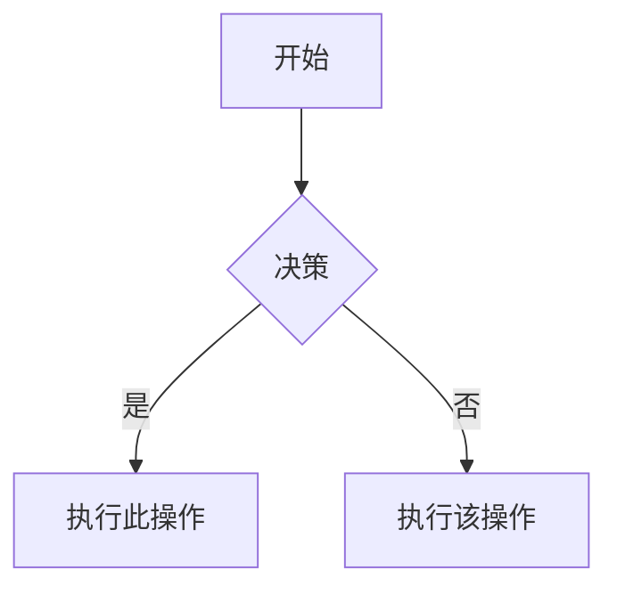

# Obsidian Flavored Markdown 技能

创建和编辑有效的 Obsidian Flavored Markdown。Obsidian 扩展了 CommonMark 和 GFM，包含 wikilinks、嵌入、标注、属性、注释和其他语法。此技能仅涵盖 Obsidian 特定扩展——标准 Markdown（标题、粗体、斜体、列表、引用、代码块、表格）被假定为已知知识。

## 工作流程：创建 Obsidian 笔记

1. **添加 frontmatter**——在文件顶部包含属性（标题、标签、别名）。有关所有属性类型，请参阅 [PROPERTIES.md](references/PROPERTIES.md)。
2. **编写内容**——使用标准 Markdown 进行结构化，加上下面的 Obsidian 特定语法。
3. **链接相关笔记**——使用 wikilinks（`[[笔记]]`）进行内部 vault 连接，或使用标准 Markdown 链接进行外部 URL。
4. **嵌入内容**——从其他笔记、图像或 PDF 使用 `![[嵌入]]` 语法。有关所有嵌入类型，请参阅 [EMBEDS.md](references/EMBEDS.md)。
5. **添加标注**——使用 `> [!类型]` 语法突出显示信息。有关所有标注类型，请参阅 [CALLOUTS.md](references/CALLOUTS.md)。
6. **验证**——确认笔记在 Obsidian 的阅读视图中正确渲染。

> 在 wikilinks 和 Markdown 链接之间选择：对 vault 内的笔记使用 `[[wikilinks]]`（Obsidian 自动跟踪重命名），对仅外部 URL 使用 `[文本](url)`。

## 内部链接

```markdown
[[笔记名称]]                          链接到笔记
[[笔记名称|显示文本]]             自定义显示文本
[[笔记名称#标题]]                  链接到标题
[[笔记名称#^块-id]]                链接到块
[[#同一笔记中的标题]]              同一笔记标题链接
```

通过在任何段落后追加 `^块-id` 来定义块 ID：

```markdown
此段落可以被链接到。^my-block-id
```

对于列表和引用，将块 ID 放在单独的行上，位于块之后：

```markdown
> 一个引用块

^quote-id
```

## 嵌入

在任何 wikilink 前缀 `!` 以内联嵌入其内容：

```markdown
![[笔记名称]]                         嵌入完整笔记
![[笔记名称#标题]]                 嵌入章节
![[image.png]]                         嵌入图像
![[image.png|300]]                     嵌入具有宽度的图像
![[document.pdf#page=3]]               嵌入 PDF 页面
```

有关音频、视频、搜索嵌入和外部图像，请参阅 [EMBEDS.md](references/EMBEDS.md)。

## 标注

```markdown
> [!note]
> 基本标注。

> [!warning] 自定义标题
> 带有自定义标题的标注。

> [!faq]- 默认折叠
> 可折叠标注（- collapsed，+ expanded）。
```

常见类型：`note`、`tip`、`warning`、`info`、`example`、`quote`、`bug`、`danger`、`success`、`failure`、`question`、`abstract`、`todo`。

有关完整列表（包括别名、嵌套和自定义 CSS 标注），请参阅 [CALLOUTS.md](references/CALLOUTS.md)。

## 属性

```yaml
---
title: 我的笔记
date: 2024-01-15
tags:
  - project
  - active
aliases:
  - 备用名称
cssclasses:
  - 自定义类
---
```

默认属性：`tags`（可搜索的标签）、`aliases`（用于链接建议的备用名称）、`cssclasses`（用于样式的 CSS 类）。

有关所有属性类型、标签语法规则和高级用法，请参阅 [PROPERTIES.md](references/PROPERTIES.md)。

## 标签

```markdown
#标签                    内联标签
#嵌套/标签             具有层级的嵌套标签
```

标签可以包含字母、数字（不是第一个字符）、下划线、连字符和正斜杠。标签也可以在 frontmatter 中的 `tags` 属性下定义。

## 注释

```markdown
这是可见的 %%但这是隐藏的%% 文本。

%%
此整个块在阅读视图中隐藏。
%%
```

## Obsidian 特定格式化

```markdown
==高亮文本==                   高亮语法
```

## 数学

```markdown
内联：$e^{i\pi} + 1 = 0$

块：
$$
\frac{a}{b} = c
$$
```

## 图表

```markdown

```

要将 Mermaid 节点链接到 Obsidian 笔记，添加 `class NodeName 内部链接;`。

## 脚注

```markdown
带有脚注的文本[^1]。

[^1]: 脚注内容。

内联脚注。^[这是内联的。]
```

## 完整示例

```markdown
---
title: 项目 Alpha
date: 2024-01-15
tags:
  - project
  - active
status: 进行中
---

# 项目 Alpha

该项目旨在 [[改进工作流程]]使用现代技术。

> [!important] 关键截止日期
> 第一个里程碑截止日期为 ==1 月 30 日==。

## 任务

- [x] 初始规划
- [ ] 开发阶段
  - [ ] 后端实现
  - [ ] 前端设计

## 笔记

该算法使用 $O(n \log n)$ 排序。有关详细信息，请参阅 [[算法笔记#排序]]。

![[架构图.png|600]]

在 [[会议笔记 2024-01-10#决策]] 中进行了审查。
```

## 参考

- [Obsidian Flavored Markdown](https://help.obsidian.md/obsidian-flavored-markdown)
- [内部链接](https://help.obsidian.md/links)
- [嵌入文件](https://help.obsidian.md/embeds)
- [标注](https://help.obsidian.md/callouts)
- [属性](https://help.obsidian.md/properties)
