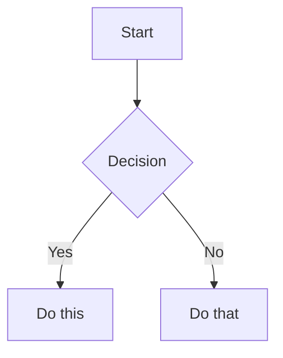

# Obsidian风格Markdown技能

创建和编辑有效的Obsidian风格Markdown。Obsidian通过维基链接、嵌入、标注、属性、注释和其他语法扩展了CommonMark和GFM。此技能仅涵盖Obsidian特定的扩展 - 标准Markdown（标题、粗体、斜体、列表、引用、代码块、表格）被视为已知知识。

## 工作流程：创建Obsidian笔记

1. **添加带属性的前置内容**（标题、标签、别名）在文件顶部。有关所有属性类型，请参阅[PROPERTIES.md](references/PROPERTIES.md)。
2. **编写内容**使用标准Markdown进行结构，加上下面的Obsidian特定语法。
3. **链接相关笔记**使用维基链接（`[[Note]]`）进行内部库连接，或使用标准Markdown链接用于外部URL。
4. **嵌入内容**使用`![[embed]]`语法从其他笔记、图像或PDF嵌入内容。有关所有嵌入类型，请参阅[EMBEDS.md](references/EMBEDS.md)。
5. **添加标注**使用`> [!type]`语法突出显示信息。有关所有标注类型，请参阅[CALLOUTS.md](references/CALLOUTS.md)。
6. **验证**笔记在Obsidian的阅读视图中正确渲染。

> 在选择维基链接和Markdown链接之间：对库内的笔记使用`[[维基链接]]`（Obsidian自动跟踪重命名），仅对外部URL使用`[text](url)`。

## 内部链接（维基链接）

```markdown
[[Note Name]]                          链接到笔记
[[Note Name|Display Text]]             自定义显示文本
[[Note Name#Heading]]                  链接到标题
[[Note Name#^block-id]]                链接到块
[[#Heading in same note]]              同一笔记中的标题链接
```

通过在任何段落后追加`^block-id`来定义块ID：

```markdown
This paragraph can be linked to. ^my-block-id
```

对于列表和引用，将块ID放在块后的单独行上：

```markdown
> A quote block

^quote-id
```

## 嵌入

在任何维基链接前加上`!`以内联嵌入其内容：

```markdown
![[Note Name]]                         嵌入完整笔记
![[Note Name#Heading]]                 嵌入部分
![[image.png]]                         嵌入图像
![[image.png|300]]                     嵌入指定宽度的图像
![[document.pdf#page=3]]               嵌入PDF页面
```

有关音频、视频、搜索嵌入和外部图像，请参阅[EMBEDS.md](references/EMBEDS.md)。

## 标注

```markdown
> [!note]
> Basic callout.

> [!warning] Custom Title
> Callout with a custom title.

> [!faq]- Collapsed by default
> Foldable callout (- collapsed, + expanded).
```

常见类型：`note`、`tip`、`warning`、`info`、`example`、`quote`、`bug`、`danger`、`success`、`failure`、`question`、`abstract`、`todo`。

有关带有别名、嵌套和自定义CSS标注的完整列表，请参阅[CALLOUTS.md](references/CALLOUTS.md)。

## 属性（前置内容）

```yaml
---
title: My Note
date: 2024-01-15
tags:
  - project
  - active
aliases:
  - Alternative Name
cssclasses:
  - custom-class
---
```

默认属性：`tags`（可搜索标签）、`aliases`（链接建议的替代笔记名称）、`cssclasses`（用于样式的CSS类）。

有关所有属性类型、标签语法规则和高级用法，请参阅[PROPERTIES.md](references/PROPERTIES.md)。

## 标签

```markdown
#tag                    内联标签
#nested/tag             带层次结构的嵌套标签
```

标签可以包含字母、数字（不是第一个字符）、下划线、连字符和正斜杠。标签也可以在前置内容中的`tags`属性下定义。

## 注释

```markdown
This is visible %%but this is hidden%% text.

%%
This entire block is hidden in reading view.
%%
```

## Obsidian特定格式

```markdown
==Highlighted text==                   高亮语法
```

## 数学（LaTeX）

```markdown
内联：$e^{i\pi} + 1 = 0$

块：
$$
\frac{a}{b} = c
$$
```

## 图表（Mermaid）

````markdown

````

要将Mermaid节点链接到Obsidian笔记，添加`class NodeName internal-link;`。

## 脚注

```markdown
Text with a footnote[^1].

[^1]: Footnote content.

Inline footnote.^[This is inline.]
```

## 完整示例

````markdown
---
title: Project Alpha
date: 2024-01-15
tags:
  - project
  - active
status: in-progress
---

# Project Alpha

This project aims to [[improve workflow]] using modern techniques.

> [!important] Key Deadline
> The first milestone is due on ==January 30th==.

## Tasks

- [x] Initial planning
- [ ] Development phase
  - [ ] Backend implementation
  - [ ] Frontend design

## Notes

The algorithm uses $O(n \log n)$ sorting. See [[Algorithm Notes#Sorting]] for details.

![[Architecture Diagram.png|600]]

Reviewed in [[Meeting Notes 2024-01-10#Decisions]].
````

## 参考

- [Obsidian风格Markdown](https://help.obsidian.md/obsidian-flavored-markdown)
- [内部链接](https://help.obsidian.md/links)
- [嵌入文件](https://help.obsidian.md/embeds)
- [标注](https://help.obsidian.md/callouts)
- [属性](https://help.obsidian.md/properties)