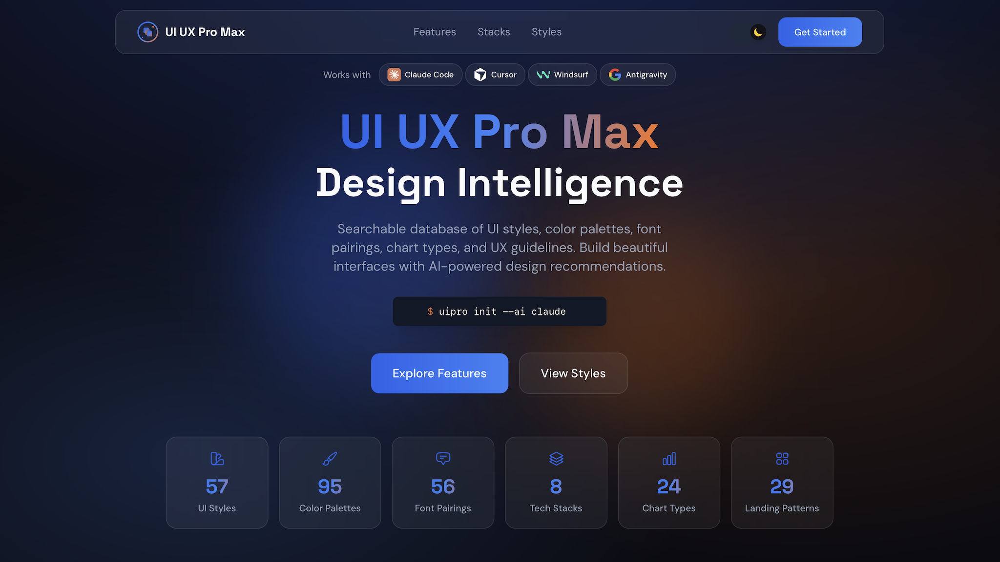

# [UI UX Pro Max](https://uupm.cc)

> 本文档是 [UI UX Pro Max](https://github.com/nextlevelbuilder/ui-ux-pro-max-skill) 项目的中文翻译版本。

## 关于本翻译

### 原项目介绍

**UI UX Pro Max** 是一个 AI 技能，为跨多个平台和框架构建专业 UI/UX 提供设计智能。它包含：

- **67 种 UI 样式** - 玻璃拟态、粘土拟态、极简主义、粗野主义、新拟态、便当盒网格、深色模式、AI 原生 UI 等
- **161 个配色方案** - 与 161 种产品类型 1:1 匹配的行业特定调色板
- **57 种字体搭配** - 精选的字体组合，包含 Google Fonts 导入
- **25 种图表类型** - 仪表板和分析的推荐
- **15 种技术栈** - React、Next.js、Astro、Vue、Nuxt.js、Nuxt UI、Svelte、SwiftUI、React Native、Flutter、HTML+Tailwind、shadcn/ui、Jetpack Compose、Angular、Laravel
- **99 条 UX 指南** - 最佳实践、反模式和可访问性规则
- **161 条推理规则** - 行业特定的设计系统生成（v2.0 新增）

### 翻译说明

本翻译将原项目的英文文档翻译成中文，包括：

- **README.md** → **README_CN.md** - 项目说明文档的中文翻译
- **SKILL.md** → **SKILL_CN.md** - 技能文档的中文翻译

翻译保持了原文档的结构和技术术语的准确性，便于中文用户理解和使用。

### 原项目链接

- [GitHub 仓库](https://github.com/nextlevelbuilder/ui-ux-pro-max-skill)
- [官方网站](https://uupm.cc)
- [NPM 包](https://www.npmjs.com/package/uipro-cli)

### 翻译项目

本翻译属于 [awesome-skills-cn](https://github.com/lingxling/awesome-skills-cn) 项目的一部分，致力于将优秀的英文 SKILL 翻译成中文。

---

<p align="center">
  <a href="https://github.com/nextlevelbuilder/ui-ux-pro-max-skill/releases"></a>
  
  
  
  <a href="https://github.com/nextlevelbuilder/ui-ux-pro-max-skill/blob/main/LICENSE"></a>
</p>

<p align="center">
  <a href="https://www.npmjs.com/package/uipro-cli"></a>
  <a href="https://www.npmjs.com/package/uipro-cli"></a>
  <a href="https://github.com/nextlevelbuilder/ui-ux-pro-max-skill/stargazers"></a>
  <a href="https://paypal.me/uiuxpromax"></a>
</p>

一个 AI 技能，为跨多个平台和框架构建专业 UI/UX 提供设计智能。

<p align="center">
  <a href="https://uupm.cc">
    
  </a>
</p>

<p align="center">
  <b>如果您觉得这个项目有用，请考虑支持项目开发：</b><br><br>
  <a href="https://paypal.me/uiuxpromax"></a>
</p>

<p align="center">
  <i>其他项目</i><br>
  <a href="https://nextlevelbuilder.io">NextLevelBuilder</a> | <a href="https://goclaw.sh">GoClaw</a> | <a href="https://claudekit.cc">ClaudeKit</a> | <a href="https://tose.sh">TOSE</a>
</p>

## v2.0 新功能

### 智能设计系统生成

v2.0 的旗舰功能是 **设计系统生成器** - 一个 AI 驱动的推理引擎，可以在几秒钟内分析您的项目需求并生成完整的定制设计系统。

```
+----------------------------------------------------------------------------------------+
|  TARGET: Serenity Spa - 推荐的设计系统                                                  |
+----------------------------------------------------------------------------------------+
|                                                                                        |
|  PATTERN: 以 Hero 为中心 + 社会证明                                                   |
|     转化策略: 情感驱动，结合信任元素                                                   |
|     CTA: 首屏上方，在客户评价后重复出现                                                |
|     版块:                                                                              |
|       1. Hero（首屏）                                                                  |
|       2. 服务介绍                                                                      |
|       3. 客户评价                                                                      |
|       4. 预订                                                                          |
|       5. 联系我们                                                                      |
|                                                                                        |
|  STYLE: 柔和 UI 演进                                                                   |
|     关键词: 柔和阴影、微妙深度、平静感、高级感、有机形状                               |
|     最佳适用: 健康养生、美容、生活方式品牌、高端服务                                   |
|     性能: 优秀 | 可访问性: WCAG AA                                                    |
|                                                                                        |
|  COLORS:                                                                               |
|     Primary:    #E8B4B8 (柔和粉)                                                      |
|     Secondary:  #A8D5BA (鼠尾草绿)                                                     |
|     CTA:        #D4AF37 (金色)                                                         |
|     Background: #FFF5F5 (暖白)                                                         |
|     Text:       #2D3436 (炭灰)                                                         |
|     备注: 平静的配色方案，金色点缀营造奢华感                                           |
|                                                                                        |
|  TYPOGRAPHY: Cormorant Garamond / Montserrat                                           |
|     风格: 优雅、平静、精致                                                             |
|     最佳适用: 奢侈品牌、健康养生、美容、编辑设计                                        |
|     Google Fonts: https://fonts.google.com/share?selection.family=...                  |
|                                                                                        |
|  KEY EFFECTS:                                                                          |
|     柔和阴影 + 平滑过渡 (200-300ms) + 温和悬停状态                                     |
|                                                                                        |
|  AVOID (反模式):                                                                       |
|     鲜艳霓虹色 + 刺眼动画 + 深色模式 + AI 紫色/粉色渐变                               |
|                                                                                        |
|  PRE-DELIVERY CHECKLIST:                                                               |
|     [ ] 不使用表情符号作为图标（使用 SVG: Heroicons/Lucide）                           |
|     [ ] 所有可点击元素设置 cursor-pointer                                              |
|     [ ] 悬停状态使用平滑过渡 (150-300ms)                                               |
|     [ ] 浅色模式: 文字对比度至少 4.5:1                                                |
|     [ ] 键盘导航时焦点状态可见                                                         |
|     [ ] 遵循 prefers-reduced-motion                                                    |
|     [ ] 响应式: 375px, 768px, 1024px, 1440px                                           |
|                                                                                        |
+----------------------------------------------------------------------------------------+
```

### 设计系统生成工作原理

```
┌─────────────────────────────────────────────────────────────────┐
│  1. 用户请求                                                     │
│     "为我的美容水疗中心构建一个着陆页"                           │
└─────────────────────────────────────────────────────────────────┘
                              │
                              ▼
┌─────────────────────────────────────────────────────────────────┐
│  2. 多域搜索（5 个并行搜索）                                     │
│     • 产品类型匹配（161 个类别）                                │
│     • 样式推荐（67 种样式）                                      │
│     • 配色方案选择（161 个调色板）                               │
│     • 着陆页模式（24 种模式）                                    │
│     • 字体搭配（57 种字体组合）                                  │
└─────────────────────────────────────────────────────────────────┘
                              │
                              ▼
┌─────────────────────────────────────────────────────────────────┐
│  3. 推理引擎                                                     │
│     • 匹配产品 → UI 类别规则                                     │
│     • 应用样式优先级（BM25 排名）                                │
│     • 过滤行业反模式                                             │
│     • 处理决策规则（JSON 条件）                                  │
└─────────────────────────────────────────────────────────────────┘
                              │
                              ▼
┌─────────────────────────────────────────────────────────────────┐
│  4. 完整设计系统输出                                             │
│     模式 + 样式 + 颜色 + 字体 + 效果                             │
│     + 需避免的反模式 + 交付前检查清单                           │
└─────────────────────────────────────────────────────────────────┘
```

### 161 个行业特定推理规则

推理引擎包含以下专业规则：

| 类别 | 示例 |
|----------|----------|
| **科技与 SaaS** | SaaS、微型 SaaS、B2B 服务、开发者工具/IDE、AI/聊天机器人平台、网络安全平台 |
| **金融** | 金融科技/加密货币、银行、保险、个人财务跟踪、发票和账单工具 |
| **医疗保健** | 医疗诊所、药房、牙科、兽医、心理健康、 medication 提醒 |
| **电子商务** | 通用、奢侈品、市场（P2P）、订阅盒、食品配送 |
| **服务** | 美容/水疗、餐厅、酒店、法律、家政服务、预订和预约 |
| **创意** | 作品集、代理公司、摄影、游戏、音乐流媒体、照片/视频编辑器 |
| **生活方式** | 习惯跟踪、食谱和烹饪、冥想、天气、日记、情绪跟踪 |
| **新兴科技** | Web3/NFT、空间计算、量子计算、自动驾驶无人机舰队 |

每条规则包括：
- **推荐模式** - 着陆页结构
- **样式优先级** - 最佳匹配的 UI 样式
- **色彩情绪** - 行业适用的调色板
- **字体情绪** - 字体个性匹配
- **关键效果** - 动画和交互
- **反模式** - 不应做的事情（例如：银行业避免使用"AI 紫色/粉色渐变"）

## 功能特性

- **67 种 UI 样式** - 玻璃拟态、粘土拟态、极简主义、粗野主义、新拟态、便当盒网格、深色模式、AI 原生 UI 等
- **161 个配色方案** - 与 161 种产品类型 1:1 匹配的行业特定调色板
- **57 种字体搭配** - 精选的字体组合，包含 Google Fonts 导入
- **25 种图表类型** - 仪表板和分析的推荐
- **15 种技术栈** - React、Next.js、Astro、Vue、Nuxt.js、Nuxt UI、Svelte、SwiftUI、React Native、Flutter、HTML+Tailwind、shadcn/ui、Jetpack Compose、Angular、Laravel
- **99 条 UX 指南** - 最佳实践、反模式和可访问性规则
- **161 条推理规则** - 行业特定的设计系统生成（v2.0 新增）

### 可用样式（67 种）

<details>
<summary><b>通用样式（49 种）</b></summary>

| # | 样式 | 最佳适用 |
|---|-------|----------|
| 1 | 极简主义与瑞士风格 | 企业应用、仪表板、文档 |
| 2 | 新拟态 | 健康/养生应用、冥想平台 |
| 3 | 玻璃拟态 | 现代 SaaS、金融仪表板 |
| 4 | 粗野主义 | 设计作品集、艺术项目 |
| 5 | 3D 与超写实主义 | 游戏、产品展示、沉浸式体验 |
| 6 | 鲜艳块状风格 | 初创公司、创意代理机构、游戏 |
| 7 | 深色模式（OLED） | 夜间模式应用、编程平台 |
| 8 | 可访问与伦理设计 | 政府、医疗保健、教育 |
| 9 | 粘土拟态 | 教育应用、儿童应用、SaaS |
| 10 | 极光 UI | 现代 SaaS、创意代理机构 |
| 11 | 复古未来主义 | 游戏、娱乐、音乐平台 |
| 12 | 扁平设计 | Web 应用、移动应用、初创公司 MVP |
| 13 | 拟物化 | 传统应用、游戏、高端产品 |
| 14 | 液态玻璃 | 高端 SaaS、高端电子商务 |
| 15 | 动态驱动 | 作品集网站、故事讲述平台 |
| 16 | 微交互 | 移动应用、触摸屏 UI |
| 17 | 包容性设计 | 公共服务、教育、医疗保健 |
| 18 | 零界面 | 语音助手、AI 平台 |
| 19 | 柔和 UI 演进 | 现代企业应用、SaaS |
| 20 | 新粗野主义 | Z 世代品牌、初创公司、Figma 风格 |
| 21 | 便当盒网格 | 仪表板、产品页面、作品集 |
| 22 | Y2K 美学 | 时尚品牌、音乐、Z 世代 |
| 23 | 赛博朋克 UI | 游戏、科技产品、加密货币应用 |
| 24 | 有机生物亲和 | 养生应用、可持续性品牌 |
| 25 | AI 原生 UI | AI 产品、聊天机器人、副驾驶 |
| 26 | 孟菲斯设计 | 创意代理机构、音乐、青年品牌 |
| 27 | 蒸汽波 | 音乐平台、游戏、作品集 |
| 28 | 维度分层 | 仪表板、卡片布局、模态框 |
| 29 | 夸张极简主义 | 时尚、建筑、作品集 |
| 30 | 动态排版 | 首屏区域、营销网站 |
| 31 | 视差故事讲述 | 品牌故事讲述、产品发布 |
| 32 | 瑞士现代主义 2.0 | 企业网站、建筑、编辑设计 |
| 33 | HUD / 科幻 FUI | 科幻游戏、太空科技、网络安全 |
| 34 | 像素艺术 | 独立游戏、复古工具、创意 |
| 35 | 便当网格 | 产品功能、仪表板、个人 |
| 36 | 空间 UI（VisionOS） | 空间计算应用、VR/AR |
| 37 | 电子墨水 / 纸张 | 阅读应用、数字报纸 |
| 38 | Z 世代混乱 / 极繁主义 | Z 世代生活方式、音乐艺术家 |
| 39 | 仿生 / 有机 2.0 | 可持续性技术、生物技术、健康 |
| 40 | 反抛光 / 原始美学 | 创意作品集、艺术家网站 |
| 41 | 触感数字 / 可变形 UI | 现代移动应用、俏皮品牌 |
| 42 | 自然提炼 | 养生品牌、可持续产品 |
| 43 | 交互式光标设计 | 创意作品集、交互式 |
| 44 | 语音优先多模态 | 语音助手、可访问性应用 |
| 45 | 3D 产品预览 | 电子商务、家具、时尚 |
| 46 | 渐变网格 / 极光进化 | 首屏区域、背景、创意 |
| 47 | 编辑网格 / 杂志 | 新闻网站、博客、杂志 |
| 48 | 色差 / RGB 分离 | 音乐平台、游戏、科技 |
| 49 | 复古模拟 / 复古胶片 | 摄影、音乐/黑胶品牌 |

</details>

<details>
<summary><b>着陆页样式（8 种）</b></summary>

| # | 样式 | 最佳适用 |
|---|-------|----------|
| 1 | 以 Hero 为中心的设计 | 具有强烈视觉识别的产品 |
| 2 | 转化优化 | 潜在客户生成、销售页面 |
| 3 | 功能丰富展示 | SaaS、复杂产品 |
| 4 | 极简直接 | 简单产品、应用 |
| 5 | 社会证明聚焦 | 服务、B2C 产品 |
| 6 | 交互式产品演示 | 软件、工具 |
| 7 | 信任与权威 | B2B、企业、咨询 |
| 8 | 故事驱动 | 品牌、代理机构、非营利组织 |

</details>

<details>
<summary><b>BI/分析仪表板样式（10 种）</b></summary>

| # | 样式 | 最佳适用 |
|---|-------|----------|
| 1 | 数据密集型仪表板 | 复杂数据分析 |
| 2 | 热图与热图风格 | 地理/行为数据 |
| 3 | 高管仪表板 | 高管层摘要 |
| 4 | 实时监控 | 运营、DevOps |
| 5 | 下钻分析 | 详细探索 |
| 6 | 比较分析仪表板 | 并排比较 |
| 7 | 预测分析 | 预测、机器学习洞察 |
| 8 | 用户行为分析 | UX 研究、产品分析 |
| 9 | 金融仪表板 | 金融、会计 |
| 10 | 销售智能仪表板 | 销售团队、CRM |

</details>

## 安装

### 使用 Claude Marketplace（Claude Code）

在 Claude Code 中使用两条命令直接安装：

```
/plugin marketplace add nextlevelbuilder/ui-ux-pro-max-skill
/plugin install ui-ux-pro-max@ui-ux-pro-max-skill
```

### 使用 CLI（推荐）

```bash
# 全局安装 CLI
npm install -g uipro-cli

# 进入您的项目
cd /path/to/your/project

# 为您的 AI 助手安装
uipro init --ai claude      # Claude Code
uipro init --ai cursor      # Cursor
uipro init --ai windsurf    # Windsurf
uipro init --ai antigravity # Antigravity
uipro init --ai copilot     # GitHub Copilot
uipro init --ai kiro        # Kiro
uipro init --ai codex       # Codex CLI
uipro init --ai qoder       # Qoder
uipro init --ai roocode     # Roo Code
uipro init --ai gemini      # Gemini CLI
uipro init --ai trae        # Trae
uipro init --ai opencode    # OpenCode
uipro init --ai continue    # Continue
uipro init --ai codebuddy   # CodeBuddy
uipro init --ai droid       # Droid (Factory)
uipro init --ai kilocode    # KiloCode
uipro init --ai warp        # Warp
uipro init --ai augment     # Augment
uipro init --ai all         # 所有助手
```

### 全局安装（适用于所有项目）

```bash
uipro init --ai claude --global   # 安装到 ~/.claude/skills/
uipro init --ai cursor --global   # 安装到 ~/.cursor/skills/
```

### 其他 CLI 命令

```bash
uipro versions              # 列出可用版本
uipro update                # 更新到最新版本
uipro init --offline        # 跳过 GitHub 下载，使用捆绑资源
uipro uninstall             # 移除技能（自动检测平台）
uipro uninstall --ai claude # 移除特定平台
uipro uninstall --global    # 从全局安装中移除
```

## 前置要求

搜索脚本需要 Python 3.x。

```bash
# 检查是否安装了 Python
python3 --version

# macOS
brew install python3

# Ubuntu/Debian
sudo apt update && sudo apt install python3

# Windows
winget install Python.Python.3.12
```

## 使用方法

### 技能模式（自动激活）

**支持：** Claude Code、Cursor、Windsurf、Antigravity、Codex CLI、Continue、Gemini CLI、OpenCode、Qoder、CodeBuddy、Droid (Factory)、KiloCode、Warp、Augment

当您请求 UI/UX 工作时，技能会自动激活。只需自然对话：

```
为我的 SaaS 产品构建一个着陆页
```

> **Trae**：首先切换到 **SOLO** 模式。该技能将为 UI/UX 请求激活。

### 工作流模式（斜杠命令）

**支持：** Kiro、GitHub Copilot、Roo Code、KiloCode

使用斜杠命令调用技能：

```
/ui-ux-pro-max 为我的 SaaS 产品构建一个着陆页
```

### 示例提示

```
为我的 SaaS 产品构建一个着陆页

创建一个医疗保健分析仪表板

设计一个深色模式的作品集网站

制作一个电子商务的移动应用 UI

构建一个深色主题的金融科技银行应用
```

### 工作原理

1. **您提出请求** - 请求任何 UI/UX 任务（构建、设计、创建、实现、审查、修复、改进）
2. **设计系统生成** - AI 使用推理引擎自动生成完整的设计系统
3. **智能推荐** - 根据您的产品类型和需求，找到最佳匹配的样式、颜色和字体
4. **代码生成** - 使用正确的颜色、字体、间距和最佳实践实现 UI
5. **交付前检查** - 验证常见的 UI/UX 反模式

### 支持的技术栈

该技能为以下技术栈提供特定指南：

| 类别 | 技术栈 |
|----------|--------|
| **Web (HTML)** | HTML + Tailwind（默认） |
| **React 生态系统** | React、Next.js、shadcn/ui |
| **Vue 生态系统** | Vue、Nuxt.js、Nuxt UI |
| **Angular** | Angular |
| **PHP** | Laravel（Blade、Livewire、Inertia.js） |
| **其他 Web** | Svelte、Astro |
| **iOS** | SwiftUI |
| **Android** | Jetpack Compose |
| **跨平台** | React Native、Flutter |

只需在提示中提及您偏好的技术栈，或让它默认为 HTML + Tailwind。

## 设计系统命令（高级）

直接访问设计系统生成器：

> 注意：如果您通过 Continue 安装，请在以下命令中将 `.claude/skills/` 替换为 `.continue/skills/`。对于 Droid (Factory)，使用 `.factory/skills/`。

```bash
# 生成 ASCII 输出的设计系统
python3 .claude/skills/ui-ux-pro-max/scripts/search.py "beauty spa wellness" --design-system -p "Serenity Spa"

# 生成 Markdown 输出的设计系统
python3 .claude/skills/ui-ux-pro-max/scripts/search.py "fintech banking" --design-system -f markdown

# 特定域搜索
python3 .claude/skills/ui-ux-pro-max/scripts/search.py "glassmorphism" --domain style
python3 .claude/skills/ui-ux-pro-max/scripts/search.py "elegant serif" --domain typography
python3 .claude/skills/ui-ux-pro-max/scripts/search.py "dashboard" --domain chart

# 特定技术栈指南
python3 .claude/skills/ui-ux-pro-max/scripts/search.py "form validation" --stack react
python3 .claude/skills/ui-ux-pro-max/scripts/search.py "responsive layout" --stack html-tailwind
```

### 持久化设计系统（Master + Overrides 模式）

将设计系统保存到文件中，以便**跨会话进行分层检索**：

```bash
# 生成并持久化到 design-system/MASTER.md
python3 .claude/skills/ui-ux-pro-max/scripts/search.py "SaaS dashboard" --design-system --persist -p "MyApp"

# 同时创建页面特定的覆盖文件
python3 .claude/skills/ui-ux-pro-max/scripts/search.py "SaaS dashboard" --design-system --persist -p "MyApp" --page "dashboard"
```

这将创建一个 `design-system/` 文件夹结构：

```
design-system/
├── MASTER.md           # 全局真实来源（颜色、排版、间距、组件）
└── pages/
    └── dashboard.md    # 页面特定覆盖（仅偏离 Master 的部分）
```

**分层检索工作原理：**
1. 当构建特定页面（例如 "Checkout"）时，首先检查 `design-system/pages/checkout.md`
2. 如果页面文件存在，其规则**覆盖** Master 文件
3. 如果不存在，则仅使用 `design-system/MASTER.md`

**上下文感知检索提示：**
```
I am building the [Page Name] page. Please read design-system/MASTER.md.
Also check if design-system/pages/[page-name].md exists.
If the page file exists, prioritize its rules.
If not, use the Master rules exclusively.
Now, generate the code...
```

## 架构与贡献

### 对于用户

代码库已重构为使用**基于模板的生成系统**。所有平台特定文件（`.cursor/`、`.windsurf/`、`.kiro/`、`.factory/` 等）现在由 CLI 动态生成。

**始终使用 CLI 进行安装：**

```bash
npm install -g uipro-cli
uipro init --ai <platform>
```

这确保您获得最新的模板和适合您 AI 助手的正确文件结构。

### 对于贡献者

如果您想为这个项目做出贡献：

```bash
# 1. 克隆仓库
git clone https://github.com/nextlevelbuilder/ui-ux-pro-max-skill.git
cd ui-ux-pro-max-skill

# 2. 了解结构
src/ui-ux-pro-max/           # 真实来源（数据、脚本、模板）
cli/                         # CLI 安装程序（从模板生成文件）
.claude/                     # Claude Code 技能的本地开发/测试
.factory/                    # Droid (Factory) 技能的本地开发/测试

# 3. 在 src/ui-ux-pro-max/ 中进行更改
# - data/*.csv              → 数据库文件
# - scripts/*.py            → 搜索引擎和设计系统
# - templates/              → 平台特定模板

# 4. 同步到 CLI 并在本地测试
cp -r src/ui-ux-pro-max/data/* cli/assets/data/
cp -r src/ui-ux-pro-max/scripts/* cli/assets/scripts/
cp -r src/ui-ux-pro-max/templates/* cli/assets/templates/

# 5. 构建和测试 CLI
cd cli && bun run build
node dist/index.js init --ai claude --offline  # 在临时文件夹中测试

# 6. 创建 PR（永远不要直接推送到 main）
git checkout -b feat/your-feature
git commit -m "feat: description"
git push -u origin feat/your-feature
gh pr create
```

有关详细的开发指南，请参阅 [CLAUDE.md](CLAUDE.md)。

## 星标历史

[](https://star-history.com/#nextlevelbuilder/ui-ux-pro-max-skill&Date)

## 许可证

本项目采用 [MIT 许可证](LICENSE) 授权。

---

## 原项目文档

如需查看原项目的英文文档，请访问：

- [README.md (英文原版)](README.md) - 原项目的完整说明文档
- [SKILL.md (英文原版)](.claude/skills/ui-ux-pro-max/SKILL.md) - 原技能说明文档

原项目由 [nextlevelbuilder](https://github.com/nextlevelbuilder) 维护。
